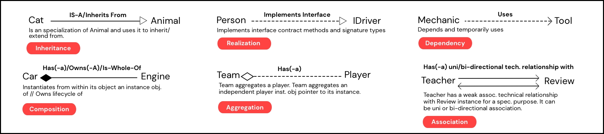
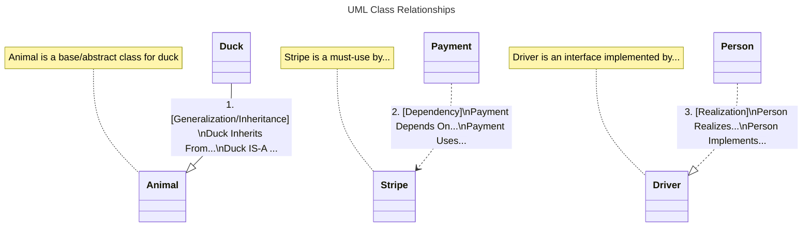
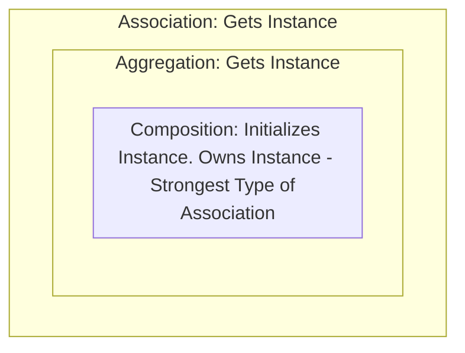
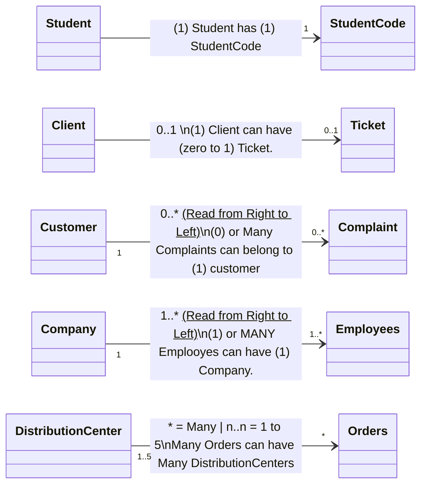

# 6 Types of Class Relationships

By Manuel Yllesca

UML has six types of class relationships; **Inheritance, Composition, Aggregation, Association, Dependency, and Realization.**

Let's get to it.

- [1. Generalization/Inheritance](#1-generalization-class-relationship)
- [2. Dependency](#2-dependency-class-relationship)
- [3. Realization/Interface](#3-realization-class-relationship)
- [4. Composition](#4-composition-class-relationship)
- [5. Aggregation](#5-aggregation-class-relationship)
- [6. Association](#6-association-class-relationship)

- [Multiplicity/Cardinality](#multiplicity--cardinality)
- [Defining: Instance Object/Instance, Instance Object Pointer/Reference, and Class Reference](#defining-instance-object-instance-object-pointer-class-and-class-reference)

**UML Class Diagram Shapes**





```mermaid
classDiagram
direction LR

    namespace AssociativeClasses{


        class University
        class Room
        class School
        class Teacher
        class 6. Association

    }

    namespace 6. Association{

        class Student
        class BookReview
        class VC
        class Founder
    }

    note "Multiplicity\nAssociative classes should indicate the number of objects per associative relationship. Multiplicity between objects:
	• No value: (1)
    • int: (e.g., 2 | Exactly two instances are associated from A to B.)
    • 1..*: (e.g., One to many)
    • n..n: (e.g., 2..10 | Specific range)

    [0 indicates that an associative relationship is optional]
    • 0..1: (e.g., 0..1 | Optional relationship | 0 with a maximum of 1.)
    • 0..: (e.g., 0.. | Optional relationship | 0 to many.)

When each side of an associative relationship has a cardinality/multiplicity value, you must read from right to left (end to beginning), not left to right (beginning to end).

Example:
Owner [1..2] ––> [1] Car
You must read: 1 car is associated with 1 or 2 owners; instead of 1 or 2 owners are associated with 1 car.

Owner ––> [1..*] Car
If the Owner doesn’t have a cardinality value, you read left to right. An empty cardinality implies a default of 1. In that case, you can read: 1 owner has 1 or many cars.
    "


    University *-- Room : 4. [Composition]\nUniversity is composed of...\nUniversity consists of/whole-for...
    class Room{
        Room is a vital part of...
    }

    School o-- Teacher : 5. [Aggregation]\nSchool Aggregates...\nSchool has a instance(s) of...

    class Teacher {
        Teacher is a part of School list\n and is aggregated to an School object..
    }


    Student --> BookReview : (Uni-directional) *Association\nOnly student Has an Association With\nStudent can call methods and attrs from...


    Founder -- VC: [Bi-directional Association]\nFounder and VC have an specific/temporary association\nand they can use each other."


```

When creating software in any language, having a solid understanding of these class diagrams will help in organizing and laying down the foundation of your software. Software design isn’t limited to these six types of class relationships, but they serve as a good starting point.

## 1. Generalization Class Relationship

### Hints for Usage:

Generalization/Inheritance: Also known as an “IS-A” relationship, it’s a type of class relationship where a class extends from another class (either a Concrete Class or Abstract Class). The child class is considered a specialized version of the parent class and inherits its methods and properties. The child class can add new methods and properties by defining them within its class, and it can override inherited properties or methods by using the same names as those used in the parent class. If the child class extends from an abstract class, it must implement the methods required by the abstract class.

> Note: Avoid creating inheritance relationships whenever possible, unless for Abstract Classes. Even then, using composition and interface contracts is generally preferred. Follow the principle of “favor composition over inheritance” to maintain better flexibility and reusability in your design.

### Requirements:

A class must extend from another concrete or abstract class to be considered of an inheritance/generalization relationship.

### Method Execution:

**Extending from a Class:** A class that extends from another class (Concrete class) acts as a specialized version of that class as the subclass is basically inheriting every implementation provided on the parent/super class (E.g. constructor, properties and methods.)

**Extending from an Abstract Class:** When a class extends from an abstract class, it's similar to extending from a Concrete Class but an abstract class may have "abstract methods" which will require logic implementation by the subclasses that extend from it.

1. Abstract classes can't be instantiated on their own.
2. Abstract classes are useful as a base template for subclasses of a similar type.
3. Abstract classes are like base templates for subclasses of a similar type to inherit from and provide specific implementation for specific methods.
4. Abstract classes can provide fully implemented methods and properties for subclasses to use promoting code reusability.

**Naming Standards for Abstract Classes:** Use a prefix such as Base or Abstract before the class name. For example: BaseUser, AbstractUser, or simply use singular class names like Human, Animal, or Vehicle.

```python
# Inheritance/Generalization relationship example #1:

# Base Class
class Character:
    def __init__(self, name, health=100):
        self.name = name
        self.health = health

    def jump(self):
        print(f"{self.name} jumps!")

    def take_damage(self, damage):
        self.health -= damage
        print(f"{self.name} takes {damage} damage. Health: {self.health}")

# Derived Class for Mario
class Mario(Character):
    def jump(self):
        print(f"{self.name} jumps super high!")  # Mario-specific jump

    def use_power_up(self):
        print(f"{self.name} uses a power-up!")

# Derived Class for Luigi
class Luigi(Character):
    def slide(self):
        print(f"{self.name} slides under a gap.")

mario = Mario("Mario")
luigi = Luigi("Luigi")

mario.jump()  # Mario-specific jump
mario.use_power_up()
luigi.jump()  # Not implemented, so jump is inherited from base class.
luigi.slide()

#--------------------------------------------------------

#Inheritance/Generalization relationship example #2:
# Abstract classes are considered part of Inheritance/Generalization

from abc import ABC, abstractmethod

# Base Abstract Class
class Character(ABC):
    def __init__(self, name, health=100):
        self.name = name
        self.health = health

    @abstractmethod # Jump() must be implemented in Derived/Child classes.
    def jump(self):
        pass #Not implemented and derived classes must provide implementation.

    def take_damage(self, damage):
        self.health -= damage
        print(f"{self.name} takes {damage} damage. Health: {self.health}")

# Mario extends from Character Abstract Class
class Mario(Character):

    def jump(self):
        print(f"{self.name} jumps super high!")  # Mario-specific jump

    def use_power_up(self):
        print(f"{self.name} uses a power-up!")

# Luigi extends from Character Abstract Class
class Luigi(Character):
    def jump(self):
        print(f"{self.name} jumps with style!")  # Luigi-specific jump

    def slide(self):
        print(f"{self.name} slides under a gap.")

# Test the classes
mario = Mario("Mario")
luigi = Luigi("Luigi")

mario.jump()
mario.use_power_up()
luigi.jump()
luigi.slide()
```

## 2. Dependency Class Relationship:

### Hints for Usage:

A dependency class relationship (Also known as Client-Supplier relationship) is a unidirectional, temporary relationship between a class A (client) and class B (supplier) for a specific technical purpose. Client (A) depends on supplier (B) to function, and changes made to supplier (B) affect client (A). For example:

1. Client gets a class(supplier)-level datatype like an instance, variable, array, list, etc.
2. Client calls a supplier method/logic without the intent of the client class to contain an instance of the supplier class on an assigned class-level local variable. It's considered the weakest "has-a" relationship. Weakest to Strongest has-a class relationships:
   1. Dependency: Temporary use without ownership.
   2. Association: Regular connection with possible mutual awareness.
   3. Aggregation: Whole-part relationship with independent lifecycles.
   4. Composition: Whole-part relationship with dependent lifecycles.
3. Unidirectional. Client depends on supplier, not the other way around. Also; supplier is typically unaware of the client class specifics.

Examples:

```python
#Dependency class relationship example #1
# Supplier class
class Logger:
    def log(self, message):
        print(f"LOG: {message}")

# Client class
class Calculator:
    def add(self, a, b):
        logger = Logger()  # Method scoped variable, used temporarily
        result = a + b
        logger.log(f"Adding {a} and {b} to get {result}")
        return result

# Usage
calc = Calculator()
calc.add(5, 3)

#---------------------------
#Dependency class relationship  example #2

# Supplier class
class Validator:
    #Note how it doesn't have a constructor. 99% of the time it doesn't.
    def validate(self, data):
        # Validation logic
        return True

# Client class
class DataProcessor:
    def __init__(self, data, validator):
        if validator.validate(data):
            print("Data is valid.")
        else:
            print("Data is invalid.")
        # Note: 'validator' is not stored as an attribute as there's no intent of further usage.

    def process(self):
        print("Processing data.")

# Usage
validator = Validator()
processor = DataProcessor("sample data", validator)
processor.process()
```

## 3. Realization Class Relationship

### Hints for Usage:

A realization class relationship is the commitment between a class and an interface where the class must provide the base requirements (contract) set by the interface.

The contract requirements set by an interface can be:

- Method
  - Names and implementation
  - Method argument types
  - Method return types
- Property
  - Property implementations
  - Property data types

An interface provides a foundational template that specifies required properties (and their types), method names (and their argument types), and return types, but without any implementation. Classes that implement an interface must adhere to this structure by defining their own versions of these methods and properties. This ensures that different classes can be used interchangeably, promoting consistency, reliability, and predictability in code, as the structure and types are enforced across implementations.

Any of the following scenarios would benefit from using interfaces or abstractions: when you want polymorphism among a group of classes, when you want to reduce complex if/else statements by enforcing type-checked method arguments, or when you need flexibility to swap between classes to create an instance of an object (as seen in creational design patterns like factory or builder patterns). In these cases, ensuring that objects implement a specific interface allows you to guarantee that required methods are available for execution.

Example: A NotificationManager class can select from the following individual classes: Email, SMS, or Whatsapp. Each of these classes implements a shared interface (e.g., Notifiable), which requires them to define their own specific implementation of the .send() method. NotificationManager can either return the instance of the selected notification type or assign it an abstract name (like notification) and then call .send() on it.

### Benefits of Realization (Using interfaces)

1. Separate implementation and specification. (High level of abstraction).
2. Enforces a contract that needs to be fulfill by multiple classes.
3. Loose coupling as classes can interact with other classes by fulfilling a contract instead of a concrete implementation. It's better to write code based on abstraction methods than a concrete implementation for a specific case of class. Swapping between Classes that connect/interact with Classes is easier as they're not bounded together by name but by the contract set by the interface.
4. Easier to test functionality. E.g. A class with a method that uses a concrete object name to execute is harder than a class that uses an abstract object name of type interface to test. Your testing is easier as objects passed as arguments follow interfaces not concrete names.
5. Enables duck typing and polymorphism. You can interchange classes that follow a common interface and execute a method not based on a concrete class but based on a interface contract.
6. Reusability. Write methods or modules based on interfaces (an abstract behaviour) in mind not a concrete functionality class.
7. Easy to extend the application design. Interfaces allows you to follow the SOLID principle "Open for extension but close for modification" as modifying functionality may create unexpected results for classes that depend on that code.
8. Better management of Dependencies. Interfaces enable Dependency Injection. It's better to inject a dependency and type check against an interface (More modular code) than implicitely instantiating an object from another method or constructor class by calling the dependency by its name.
9. Better code organization. Defining interfaces help separating methods (initial base schema) from implementation (concrete classes implementing) making the codebase easier to maintain.
10. IDEs support. IDEs would typically compare argument types and method return types against the defined interfaces, making it easier and faster to catch errors in code.

### Requirements:

In an interface, you can only define the protocol’s class name, class properties, method names, argument types, and method signatures (return values). All method implementations must be provided by the concrete class that implements the interface. Interfaces cannot be instantiated on their own; they require a class to implement them and fulfill the contract defined by the interface.

```python
from typing import Protocol

# Defining a Protocol as an Interface for payment processors
class PaymentProcessor(Protocol):
    def process_payment(self, amount: float) -> None: # classes imlpementing must have process_payment method implemented.
        ...

# Implementing basic classes that adhere to the PaymentProcessor interface
class CreditCardPayment: #we could have done: CreditCardPayment(PaymentProcessor)
    def process_payment(self, amount: float) -> None:
        print(f"Processing credit card payment of ${amount:.2f}")

class PayPalPayment(PaymentProcessor): #we could have done: PayPalPayment: (without the interface) and it'd work fine as we're calling this instance and comparing it against the interface PaymentProcessor and it'd be true as it has defined a process_payment method in it.
    def process_payment(self, amount: float) -> None:
        print(f"Processing PayPal payment of ${amount:.2f}")

# A function using the PaymentProcessor interface as a type hint for type checking the instances passed to execute the method process_payment.
def make_payment(processor: PaymentProcessor, amount: float) -> None:
    processor.process_payment(amount)

# Creating instances of payment processors
credit_payment = CreditCardPayment()
paypal_payment = PayPalPayment()

# Using the make_payment function with different processors
make_payment(credit_payment, 100.0)  # Output: Processing credit card payment of $100.00
make_payment(paypal_payment, 50.0)   # Output: Processing PayPal payment of $50.00

```

## 4. Composition Class Relationship

### Hints for Usage:

An instance of a class (Owner) “has-a” or “owns” an instance of another class (Component), which is created within the Owner instance. The lifecycle of the Component instance is fully tied to its Owner. The Component cannot exist outside the Owner instance because it is an essential part of it. When the Owner instance is destroyed, all objects it owns, including the Component instance, are also destroyed.

Example:
Consider a Vehicle class. In our application, we create three separate instances of Vehicle. The constructor (**init**) of the Vehicle class automatically creates an instance of the Engine class and assigns it to the Vehicle instance. Each Vehicle instance (e.g., Car, Truck, Motorcycle) will have its own unique Engine instance. These Engine instances can be customized independently for each Vehicle instance.

**UML Representation:** Filled diamond shape represents the (Owner) instance object containing another (Component) instance object.

### Best Practices

When the (E.g. owner) class instantiates an instance object of another class, set it as private to indicate that it should not be accessed outside the class that creates it. The instance is intended to be used exclusively within the class scope. For example, apply the following to make the Component instance a class-scoped instance inside Owner class prohibiting external access: self.\_\_engine = Engine().

### Requirements:

A valid composition relationship is when Owner class instantiates an instance object of a Component class within its class through a constructor. <ins>\*Note: A component class typically belong to a single "type" of class. Many (owner) instances of the same class will have/control their own (component) instance object of the same class.</ins>

### Functionality Implementation:

Methods specific to the (Component) class should be written in the (Component) class; Methods related to both; Owner and Component classes should be written in the (E.g. Owner) class. Methods of (Component) will always be executed through the instance object created in (E.g Owner) class.

```python
# Composition Relationship Example #1:
class Engine: #(E.g. Component - Engine)
    def __init__(self, horsepower):
        self.horsepower = horsepower

    def start(self):
        print(f"Engine with {self.horsepower} HP is starting.")

class Car: #(E.g. Owner - Car)
    def __init__(self, engine_class, horsepower):

        engine_class(100) # This is the minimum for the relationship between Car (E.g. Owner) - Engine (E.g. Component) to be considered composition.

        self.engine = engine_class(horsepower) # ()/Parenthesis instantiates a NEW class Engine and is assigned to a class-scoped instance object "self.engine".

        self.__engine = engine_class(horsepower) # ** Having it as private "self.__engine" is recommended to ensure that no other class has easy access to interaction with the Engine.

        self.engine_pointer = engine_class # Using () forces the instantiatiation of an object of class Engine "arg: engine_class"; without () is a reference/pointer to an already instantiated object of Engine class. (If engine_class was already instantiated and passed to this constructor as the engine_class argument, then car self.engine would be an object reference/pointer and changes to it would affect to that specific object instance. Changes to an object reference/pointer modify the actual object and changes are visible through all classes with a reference/pointer to that particular instance object.


    def drive(self):

        self.engine.start() #self.engine was instantiated in the Car constructor. Self.engine is an instance object created from our own class Car. self.engine has all properties, methods of class Engine but it's owned and managed by Car class. Car own/has-a its own instance object of Engine and it's executing the methods he got by instantiating it.

#Many classes can instantiate and get their own instance object of the Engine class.
class Truck:
    def __init__(self, engine_class, horsepower):

        self.engine = engine_class(horsepower) # Class Truck constructor has its own instance object of class Engine. Owned and  managed by class Truck from its self.engine object (truck.engine). If a truck instance is deleted every method, attribute, and object created within that instance gets deleted as well.

    def drive(self):
        self.engine.start()

# main.py: The next line is passing a "Class reference" not an specific "Object reference" as it has not been initialized () yet.

car = Car(Engine, 132) # A class Engine reference not an actual object (There are no ()) so Car can instantiate its own object instance in its class.
truck = Truck(Engine, 132) # A class Engine reference not an actual object (There are no ()) so Truck can instantiate its own object instance in its class.
car.drive()
```

## 5. Aggregation Class Relationship:

### Hints for Usage:

An instance object of a class (e.g., Team) “IS-THE-WHOLE-OF” or “HAS-A” relationship with another instance object of a class (e.g., Player). This means a class (“Whole”) can aggregate an already-existing instance of another class (“Part”) to its instance by holding a reference to it. Since the “Part” instance is created independently outside the “Whole,” both “Whole” and “Part” are independently managed, and any changes the “Whole” makes to this shared “Part” instance will affect all other references to that same instance. In aggregation, the Whole doesn't own the instance/instantiates the instance in itself because "Part" instance may be used by other object instances of another types of classes and they may want to interact with "Part" instances.

Typically, the “Whole” will aggregate the “Part” through its constructor or other methods.

Example:

> Team (Whole) has an attribute self.name set to "Real Madrid" in its constructor, along with an empty list of players. Inside the Team class, there’s a method like add_player(player), which takes a Player object as an argument. This method adds individual player instances to the list of players.

Here, Real Madrid is aggregating player instances to form its team. This allows Real Madrid (the “Whole”) to manage, read, or modify its players (the “Parts”). Importantly, even if the Real Madrid instance is deleted, the player instances remain intact. Another team (e.g., Barcelona) could also aggregate these players or add new ones. Thus, the lifecycle of a player instance belongs to the player itself, not the “Whole,” distinguishing it from composition.

A useful method example would be Whole.pay_players(), which could iterate through self/Whole.players, access each player’s player.salary attribute, and process the payment accordingly.

**UML Shape Representation:** Represented by an unfilled diamond.

### Requirements:

- The lifecycle of the Part instance is independent of the Whole instance.
- The Part instance is created before being aggregated into the Whole.
- If the Whole instance is deleted, the Part instance remains unchanged, retaining all its attributes, methods, and states.
- The Whole only holds a reference (e.g., a “link”) to the "Part" instance. Any changes made to the Part by the Whole affect all references to that instance.

### Functionality Implementation:

Methods related to interactions between Whole and Part should be implemented in the Whole class. However, methods specific to the Part should be implemented within the Part class itself, especially if the Part can be aggregated into multiple different types of Wholes.

For example:

- Whole class #1: Company
- Whole class #2: House
- Part class #1: Person

Here, a Person instance can be aggregated by both Company and House. If Person needs to change its nickname, we don’t duplicate this functionality across the Whole classes (Company.change_person_nickname() and House.change_person_nickbname()). Instead, we implement it in the Person class itself (person.change_nickname())

Thus, instead of changing the Person nickname attribute using a Whole method or from Whole aggregated list like house.person[0].nickname = "Manuel" or company.person[0].nickname = "Manuel", you would call person.change_nickname("Manuel") on the Person instance. This approach maintains a single source of truth, reduces code duplication, and ensures consistent behavior across all references.

```python

#Aggregation Relationship example #1:

class IPart(Protocol):
    name: str
    age: int
    score: int

    def add_score(self, score: int):
        pass


class Part(IPart):  # Another concrete class (E.g. players). Bonus: following an interface.

    def __init__(self, name: str, age: int, score: int):
        self.name = name
        self.age = age
        self.score = score

    def add_score(self, score: int):
        print(
            "Adding score to",
            self.name,
            ": +",
            score,
        )
        self.score += score


class Whole: # Another concrete class (E.g. team)

    def __init__(self, name: str):
        self.name = name
        self.players: list[IPart] = []
        self.score = 0
    def add_player(self, player: IPart):
        self.players.append(player)
        # add_player accepts an already instantiated instance object of type IPart(protocol) for Whole to keep a list of players and have it linked locally in its instance
        # Changes made to the pre-initialized instance object in Whole will be visible to other instances that have that player instance referenced in its object.

    def add_score(self, player: IPart, score: int):
        player.add_score(score)
        #we're adding score to the player by calling its instance object, but this also affects the team.
        # we could self.score += 1 (to sum the total score of the team).


    def show(self):
        for player in self.players:
            print(
                "team: ",
                self.name,
                "player name:",
                player.name,
                "age:",
                player.age,
                "Total score:",
                player.score,
            )

    def winning(self):

        max_score = max(player.score for player in self.players)

        for player in self.players:
            if player.score == max_score:
                print(f"{player.name} won with a score of {player.score}")
                break


def main():

    team = Whole("Real Madrid")  # Instantiating an instance of Whole.

    player_1 = Part(
        name="Manuel", age=32, score=1
    )  # creating an instance of part
    player_2 = Part(
        name="Christiano", age=41, score=9
    )  # creating a second instance of part

    team.add_player(player_1)
    # Sending the player1 instance to team (Whole) for team to aggregate it into its list of players.
    # Think of player1 as a HYPERLINK to its existing instance.

    team.add_player(player_2)
    # Sending the player2 instance to team (Whole) for team to aggregate it into its list of players.
    # Think of player2 as another HYPERLINK to the existing instance.

    team2 = Whole("Barcelona")  # creating another instance of Whole.

    team2.add_player(player_1)
    # Sending the player_1 instance to team2 (Whole) for team2 to aggregate it into its list of players.
    # Think of it as player_1 is only a "link/reference" to an already instantiated instance.
    # player_1 is PART OF both (team and team2) and is the same instance in each. Changes made to the player_1 instance through either team or team2 will be reflected across all references to that instance.

    team.show()

    # ------ ALL THREE METHODS ACHIEVE THE SAME RESULT ------
    # CHANGES WILL BE REFLECTED ACROSS ALL THREE AS THEY HAVE THE SAME PLAYER_1 REFERENCE

    player_1.score = 99  # Through the direct instance. score = 99.
    team.players[0].score = 99
    # team.players has a players list where key 0 of the list has a player_1 instance reference as passed prior.
    team2.players[0].score = 99
    # team2.players has a players list where key 0 of the list has a player_1 instance reference as passed prior.

    # ------------------------------

    team.add_score(player_1, 99)  # passing instance object we're adding score to

    team.show()
    team.winning()
    team2.show()


if __name__ == "__main__":

    main()

#Aggregation Relationship example #2:

class Teacher:
    def __init__(self, name, subject):
        self.name = name
        self.subject = subject

    def introduce(self):
        return f"Hello, I am {self.name} and I teach {self.subject}."

class School:
    def __init__(self, name):
        self.name = name
        self.teachers = []  # This will hold a list of Teacher instances

    def add_teacher(self, teacher):
        self.teachers.append(teacher) # This is an instance reference as Teacher isn't instantiated here (we aren't doing Teacher()).

        # If there were only one Teacher, we could write: self.teachers = teacher without (), and it would be the same. However, in this example, we’re demonstrating lists.


    def show_teachers(self):
        for teacher in self.teachers:
            print(teacher.introduce())

# Creating Teacher instances independently
teacher1 = Teacher("Mr. Smith", "Math")
teacher2 = Teacher("Ms. Johnson", "Science")

# Creating an instance of class School
school = School("Greenwood High")

# Passing teacher instances to school (aggregation)
school.add_teacher(teacher1) #teacher1 instance passed to school to interact
school.add_teacher(teacher2) #teacher2 instance passed to school to interact

# Showing teachers at the school
school.show_teachers()

#School and Teacher are independent objects; their lifecycles don’t depend on each other. If an instance of School is deleted, the Teacher instances would still be accessible, along with any changes made by any school that aggregated them. In composition, a Whole instance owns another Part instance, as it is instantiated within that Whole instance.

```

## 6. Association Class Relationship:

### Hints for usage:

To understand association, it is important to clearly understand composition and aggregation, as they are forms or subsets of an association relationship. Aggregation and composition are considered specialized types of association relationships.

- Association (A uses B) is a weaker association relationship than
- Aggregation (A has-a/is-whole-of-part B), and aggregation has a weaker association compared to
- Composition (A OWNS-a/is-whole-of-part/no-other-classes-but-A-needs B), which is the strongest form of an associative relationship.

To clarify: An association is a connection or relationship between two objects (similar to aggregation and composition) that isn’t composition or aggregation, often representing a sporadic or technical relationship to solve a specific purpose.



In aggregation and association relationships, instance objects are passed through arguments in the constructor (commonly in aggregation) or methods (in aggregation or association). Composition is the only type of associative relationship where the class creates instance objects within its constructor, leading to a class owning the lifecycle of the associated class.

> \*It common for association and aggregation relationships to hold or store in their instances a local variable or list with instance object references.

An association class defines the relationship between two independent objects or instances of different classes that, for one or many reasons, collaborate together.

For example, a Teacher class and a Student class are independent, but we decide to develop technical functionality between them called ReviewExam. We create an intermediary class called ReviewExam, where we aggregate both objects to work together towards reviewing an exam through methods implemented in ReviewExam. Remember, neither Teacher nor Student holds a direct reference to each other as part of their attributes. This association is “weak,” “non-essential,” and sporadic compared to composition or aggregation relationships.

This is beneficial when you need to maintain loose coupling between instances and allow collaboration between classes. All instances are independent but are connected through this class to execute functionality.

### Requirements

Association should be used when the relationship between classes is less binding than aggregation and composition. It’s not worth having the method functionality in an important aggregational or compositional class. It implies a less restrictive relationship, where the main focus is on facilitating an operation or interaction between classes without implying ownership or lifecycle dependency.

Association is used to execute methods or interactions that involve two or more instance objects of different class types to solve a specific technical purpose. Because it is non-essential, it’s not worth having these specific method implementations in a core class.

```python
# Association Class relationship example

class Teacher: #independent class

    def __init__(self, name):
        self.name = name

    def assess_exam(self):
        print(f"Teacher {self.name} is reviewing the exam.")

class Student: #independent class
    def __init__(self, name):
        self.name = name

    def submit_exam(self):
        print(f"Student {self.name} has submitted the exam.")

class ReviewExam: #this is the association class created solely to facilitate an operation between student and teacher classes

    def __init__(self, teacher, student):
        self.teacher = teacher
        self.student = student

    def review(self):
        self.student.submit_exam()
        self.teacher.assess_exam()
        print("Exam has been reviewed.")

# Creating instances
teacher = Teacher("Ms. Johnson")
student = Student("Alice")
review_exam = ReviewExam(teacher, student)

# Execute the interaction
review_exam.review()
```

## Multiplicity / Cardinality

When an associative class relationship (Composition, Aggregation, and Association) <ins>has multiplicities on each end</ins>, you must **read from right to left or end to beginning**. If only one is provided, then read from left to right.



## Defining Instance Object, Instance Object Pointer, Class, and Class Reference

**Instance Object/Instance (of a Class) Reference**: An instance object of a class is the realization of an object from a class getting a unique identifier stored in memory. An instance object "refererence/pointer" is a pointer holding the unique ID of an already-initialized object in memory. Instance object references are typically passed as arguments to other objects, classes, methods, and functions allowing them to interact with the specific state and behavior of that specific instance object (e.g., modifying, reading, or executing methods and attributes related to that instance object).

> \*The terms “instance object” and “instance” mean the same thing: a realized instance of a class with a unique ID or address in memory. The term “object” is widely used to refer to the same as an “instance object” or “instance,” but it’s not limited to that. An object is a general term for any data structure that can store data and behavior.

**Class Reference:** Refers to the class itself (not initialized; when initialized, it becomes an object/instance of the class). A class reference is typically used for three main purposes:

1. Creating New Instances: Class references allow new instances to be created, which is often used in creational design patterns.
2. Type Checking: Class references are used to check if an object is an instance of a specific class, ensuring it adheres to the expected type.
3. Executing Static and Class Methods.
   - @staticmethod: A method that behaves like an isolated function within a class. It does not have access to the instance (self) or class (cls) and cannot interact with class-level methods or attributes directly. It is primarily a utility function that is logically related to the class but independent of instance or class state.
   - @classmethod: A method that takes the class (cls) as its first argument, allowing it to access and modify class-level methods and attributes. A common use case for @classmethod is as an alternative constructor that can accept specific arguments to customize the initialization process and return a new instance with those custom attributes.

> Note: While @staticmethod and @classmethod have specific use cases, their excessive use can sometimes make code harder to read and maintain.
